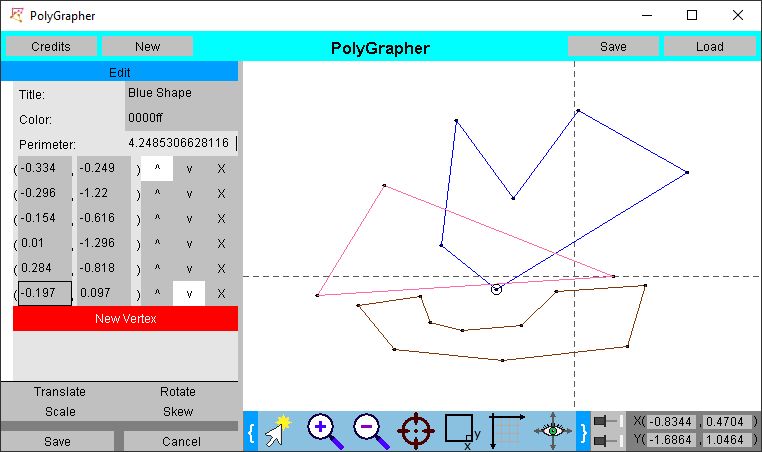

# Poly-Grapher
A simple polygon graphing program. PolyGrapher is built to be quick and versatile. Polygons can be loaded from and saved to a text file for increased usability.

## Technologies
* Java version of at least 1.8
* Moulton Scalable Menus version 1.14

A pre-compiled jar file is also available for download.

## Use

### Shape Creation
Create a new shape either by pressing the red "New Shape" button on the "Shapes" page, or by clicking anywhere on the canvas while on mouse creation mode (though the latter action will only create a new shape if one is not already selected).

### Shape Editing
While on the "Edit" page, there are a variety of different alterations that can be made to the shape. At the top of the page, the shape can be renamed by the "Title" text box. Immediately beneath that is the "Color" text box, where the hexadecimal color specified will be used to draw the polygon's edges. Common colors in hexadecimal include ff0000 for red, 00ff00 for green, and 0000ff for blue. Beneath the color text box is a perimeter field that gives the total perimeter of the shape.

The shape's vertices can also be moved, deleted, or added to on the edit page. To create a new vertex, press the "New Vertex" button. (Optionally, you can click anywhere on the canvas while in mouse creation mode to create a new vertex at that position.) For each vertex, text boxes display the x and y position, and three buttons can be used to swap the vertex with that above it, to swap the vertex with that below it, or to remove the vertex, respectively. Placing the mouse on any of these features will highlight the vertex on the canvas.

When you have finished editing a shape, press the "Save" button on the bottom left-hand corner. If for any reason you wish to revert back to the state before the edit page was launched, press the cancel button. Both of these options will return you to the shapes page, from which another shape can be selected or created.

### Canvas Operations
There are a number of canvas operations that affect how the shapes are shown. The shape control buttons are at the bottom, below the white canvas.

The first button on the blue button bar is the mouse toggle. This button is either in mouse creation state (with the yellow star) or mouse movement state. You can toggle between the two states by pressing the button. While in mouse creation state, you can click directly on the canvas to make new vertices. While in mouse movement state, you can click and drag on the canvas to move the perspective.

The second and third buttons on the blue button bar are the zoom in and zoom out buttons. Clicking on the zoom in button will decrease the size of the perspective around the center, effectively zooming in. Clicking on the zoom out button will increase the size of the perspective around the center, effectively zooming out. The amount of the zoom is proportional to the scale of what is being shown. Optionally, you can zoom in and out by scrolling on the canvas.

The fourth button is the center button. Clicking on this button will center the canvas perspective around all the loaded shapes, which may affect the position and dimensions of the perspective.

The fifth button is the square button. When clicked on, the square button will make the scale of the x and y axis shown 1:1.

The sixth button is the y direction toggle button. There are two states to this button: the downward y (default) and the upward y. Clicking the button will toggle between the two states. The current selected state will determine whether positive y values should be rendered below negatives (as in computer graphics) or above negatives (as in mathematics).

The seventh button is the show axese button. There are two states, shown axes and hidden axes.

### Canvas Control Panel
To the right of the button bar is the canvas control panel. On this panel, the size of the canvas and the coordinates shown can be directly modified.

On the left, there are pin buttons. Clicking an unpinned button will pin it, and clicking a pinned button will unpin it. When the pin buttons are pressed down, no changes can be made to the selected axis. This is very helpful in conjunction with the buttons on the button bar. For example, if the x-axis is pinned, a zoom out would only zoom out on the y-axis.

On the right of the pinning buttons is the coordinate control text boxes. Here, the perspective can be modified directly. It is also updated when the canvas perspective changes.
